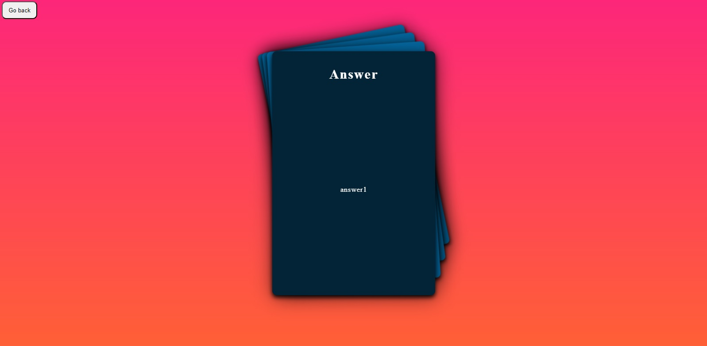
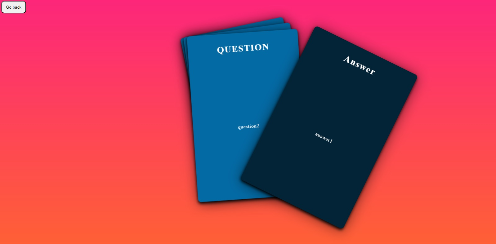

# Flashcards

This project is created as a method of review and reinforcement of knowledge, based on questions and answers; where you can create and edit your JSON files and save them by theme.

## Built with 🛠️
This project was created with:

## About the project 📖
The project is simple and easy to use.
It is recommended to use it only on PC, since the project is not responsive.

## how does it work 🎴
You can create a new question file by pressing the (New JSON) button.
.jpg)

Or if you already have question files, you can drag or click on the dark area.
.jpg) 

After you have your questions uploaded, you can edit them or start your review; or also, if you wish, you can create a new questions file.
.jpg)

At the end, we have two check buttons to select the way you want to interact with your cards:
✅ ####Infinite: You will be able to see your questions without having to restart the questions.
✅ ####Random: The cards are shuffled before you start your review.
.jpg)

When you start your review, you will be able to see the cards ordered as follows:

If you need to verify the answer, you can double click on the card to rotate it.

When you want to continue to the next question, you can drag the top card out of the area.

Finally. In the upper left part you can see the button to return to the main menu if you wish.